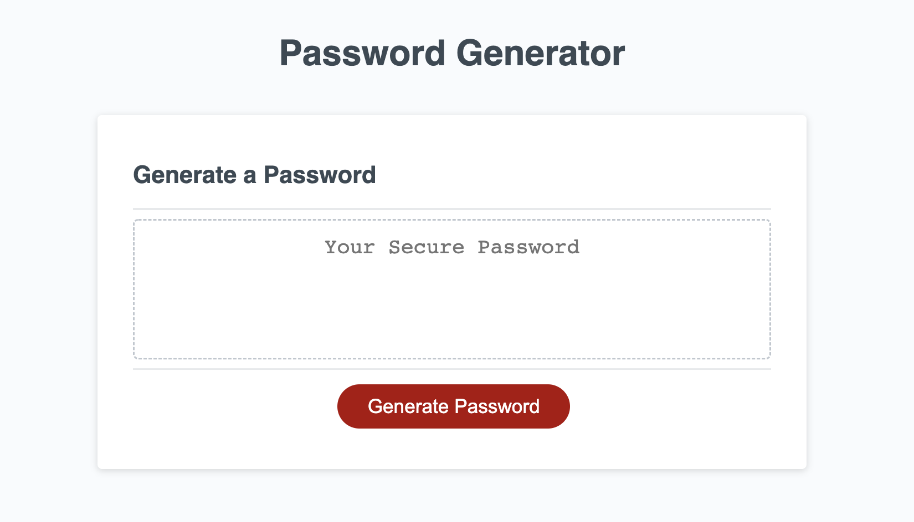
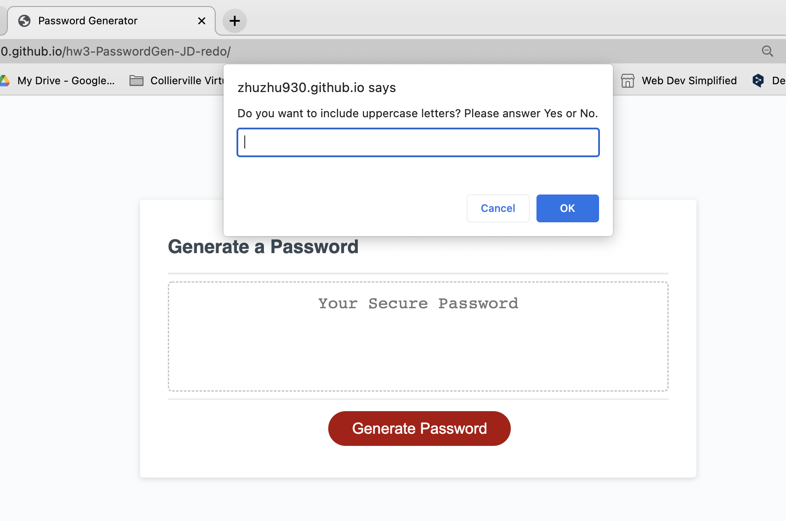
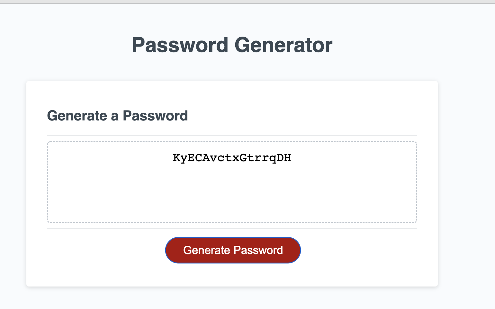

# 03 JavaScript: Password Generator

## By Jessie Doherty

## URLs

- GitHub repo: https://github.com/zhuzhu930/hw3-PasswordGen-JD-redo
- GitHub pages: https://zhuzhu930.github.io/hw3-PasswordGen-JD-redo/

## User Story

AS AN employee with access to sensitive data
I WANT to randomly generate a password that meets certain criteria
SO THAT I can create a strong password that provides greater security

## App features

- WHEN the user clicks the button to generate a password, he/she is presented with a series of prompts for password criteria.
- After answering each question, such as whether the user want's to include lowercase letters, uppercase letters, numerics, special characters and the length of the password, a random password is generated by the app.
- The password will be displayed in the page's text area, replacing "My Secure Password"

## Screenshots of different stages

The following images shows the web application's appearance and functionality:

- Landing page:
  
- Prompts page:
  
- Password generated:
  

## Project planning

1. Using the starter code to connect the DOM.
2. Declare variables in the Global scope so I can use them in functions and event listeners.
3. Captuer prompts answers entered by the user and store them in a user, then I wrap the entire block of code in a function called storePrompts, so I can call it later in the event listener.
4. Use arrays to store lowercase, uppercase, numerics, and special characters, I used four sets to store them.
5. Based on the user's input, I need to concatenate arrays and store them in new arrays, I've done this for:

- allArrays: include all characters, cocatenating 4 sets mentioned above.
- 2 options chosen: six sets of new arrays are stored.
- 3 options chosen: four sets of new arrays are stored.

6. Use for loops to iterate an array and generate a ramdon string. Once successful, wrap the for loop with a conditional statement to add conditions based on the user's answers. There're 11 conditional statements in total.
7. Wrap the entire conditional statement block into a function called "generate".
8. Add an event listener to the Generate Button on the HTML. Call function storePrompts and generate in an order, finally write the generanted password into innerHTML.

## Problems encountered

1. Due to the scope, it took me a while to figure out the best way to declare my variables.
2. I want to reset the text area when the Generate Button was clicked before generating the password, it took me a while to figure out where to put the reset code. Eventually I decide to put it in the generate function so when ever the function is called, the text area is empty to accept the new set of random string.

## Lesson learned and future development

- Scope is important when declaring variables.
- I still feel my code is a bit cumbersome, hopefully I can improve this part and write cleaner code.

## License

Copyright <2022> <COPYRIGHT Jessie Doherty>

Permission is hereby granted, free of charge, to any person obtaining a copy of this software and associated documentation files (the "Software"), to deal in the Software without restriction, including without limitation the rights to use, copy, modify, merge, publish, distribute, sublicense, and/or sell copies of the Software, and to permit persons to whom the Software is furnished to do so, subject to the following conditions:

The above copyright notice and this permission notice shall be included in all copies or substantial portions of the Software.

THE SOFTWARE IS PROVIDED "AS IS", WITHOUT WARRANTY OF ANY KIND, EXPRESS OR IMPLIED, INCLUDING BUT NOT LIMITED TO THE WARRANTIES OF MERCHANTABILITY, FITNESS FOR A PARTICULAR PURPOSE AND NONINFRINGEMENT. IN NO EVENT SHALL THE AUTHORS OR COPYRIGHT HOLDERS BE LIABLE FOR ANY CLAIM, DAMAGES OR OTHER LIABILITY, WHETHER IN AN ACTION OF CONTRACT, TORT OR OTHERWISE, ARISING FROM, OUT OF OR IN CONNECTION WITH THE SOFTWARE OR THE USE OR OTHER DEALINGS IN THE SOFTWARE.
